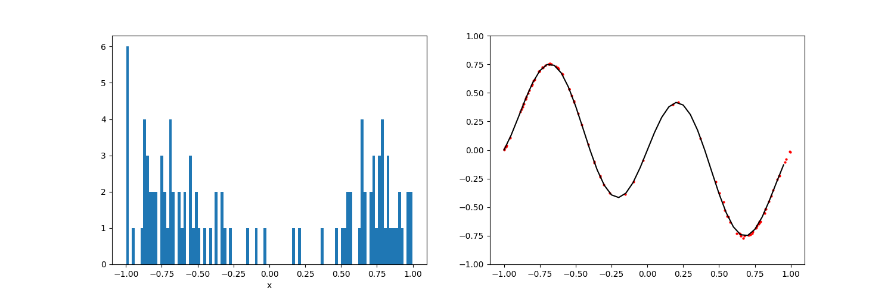
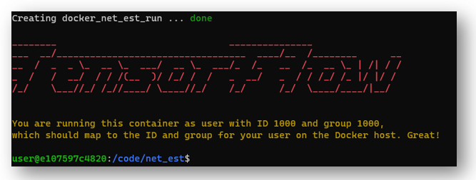

# Network Uncertainty

[](https://github.com/Naereen/StrapDown.js/blob/master/LICENSE)
[](https://www.python.org/downloads/release/python-370/)
[](https://pypi.org/project/tensorflow/)


Network Uncertainty implements methods for estimating neural network prediction intervals for regression tasks.  Currently, 
the following methods are provided:

* Bootstrap (Pairs Sampling)
* Delta (TODO)
* Mean-Variance Estimation (TODO)
* Bayesian (TODO)
* Dropout enabled during inference

The data generating process is based on the implementation provided in: 

["A Study of the Bootstrap Method for Estimating the Accuracy of Artificial Neural
Networks in Predicting Nuclear Transient Processes"](https://ieeexplore.ieee.org/document/1645061)

The input data, x, is selected based on the probability distribution shown below (left panel), resulting in the sampled
red points (middle panel).  The sample noise variance is dependent on x as shown in the right panel.

<p align="center">
  
</p>

## Prerequisites
All required packages are located in `Docker/requirements.txt`.  The preferred way of running this code is through a
docker container using `docker-compose.yml` and `net_est.dockerfile`.  To run the docker container, you must add a `.env`
file to the Docker directory with the following arguments updated:

```markdown
USER_ID=your_user_id
GROUP_ID=your_group_id
DEV_CODE='path\to\src\folder'
DEV_IMAGE='path\to\images\folder'
DEV_DATA='path\to\data\folder'
DEV_CONFIG='path\to\configs\folder'
DEV_RESULTS='path\to\results\folder'
```
After updating `.env`, the following command will build the docker container:

```markdown
docker-compose -f docker-compose.yml up
```

## Bootstrap (Pairs Sampling)
First, run the following command to get an interactive terminal within the docker container:
```markdown
docker-compose -f docker-compose.yml run net_est
```

<p align="center">
  
</p>

Run the following command to start the bootstrap training:
```markdown
python -m main -config_name=noisy_sin -method=bootstrap
```

## Dropout
```markdown
python -m main -config_name=noisy_sin -method=dropout
```
