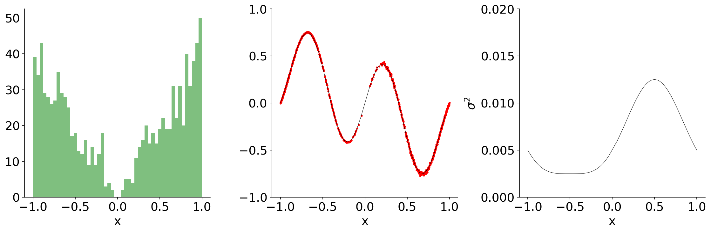

# Network Uncertainty

Network Uncertainty implements methods for estimating neural network prediction intervals for regression tasks.  Currently, 
the following methods are provided:

* Bootstrap (Ensemble Networks)
* Dropout enabled during inference

The data generating process is based on the implementation provided in: 

["A Study of the Bootstrap Method for Estimating the Accuracy of Artificial Neural
Networks in Predicting Nuclear Transient Processes"](https://ieeexplore.ieee.org/document/1645061)

<p align="center">
  
</p>

## Prerequisites
All required packages are located in `Docker/requirements.txt`.  The preferred way of running this code is through a
docker container using `docker-compose.yml` and `net_est.dockerfile`.  To run the docker container the `.env` file must 
be updated to your particular system paths. After updating `.env`, the following command will build the docker container:

```markdown
docker-compose -f docker-compose.yml up
```